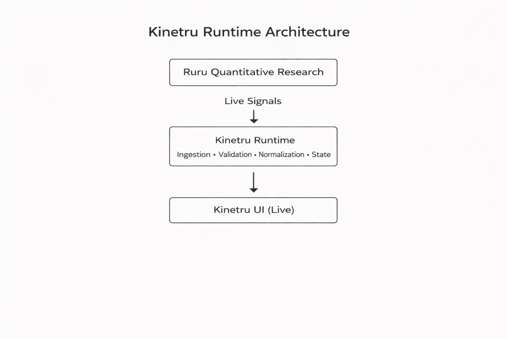

# Kinetru Runtime

Kinetru Runtime is the live signal delivery layer of the RuruSystems ecosystem.

It is responsible for ingesting, normalizing, and delivering real-time signals from the research layer to the Kinetru interface.

---

## Why This Exists

Quantitative research systems generate live signals, but product interfaces require:

- consistent data structures  
- stable delivery mechanisms  
- replayable signal history  
- low-latency access  

Kinetru Runtime exists to bridge this gap by providing a dedicated layer for live signal ingestion and delivery.

---

## System Position

Ruru Quantitative Research  
↓  
Kinetru Runtime  
↓  
Kinetru UI (Live / Replay)

---

## Runtime Flow

---

## Core Responsibilities

### Ingestion
Receives live signal outputs from Ruru Quantitative Research.

### Validation
Ensures incoming data is consistent, complete, and usable.

### Normalization
Transforms signals into a unified schema for downstream consumption.

### State Management
Maintains latest signal state and recent history for replay.

### Replay Support
Enables reconstruction of recent signal transitions and timelines.

### Delivery
Exposes live data through APIs for Kinetru UI consumption.

---

## Execution Flow

1. Live signals are generated by Ruru Quantitative Research  
2. Runtime ingests incoming signal data  
3. Data is validated and normalized  
4. Latest state and history are maintained  
5. Structured outputs are exposed via APIs  
6. Kinetru UI consumes and renders live signals and replay  

---

## System Boundaries

Kinetru Runtime does NOT:
- generate market signals  
- perform interpretation or analysis  
- produce session-level reports  
- replace product interface logic  

Kinetru Runtime ONLY:
- ingests live signals  
- normalizes and structures data  
- maintains state and replay  
- delivers outputs to the UI  

---

## Relationship with Other Systems

- **Ruru Quantitative Research**  
  Generates live signals and quantitative outputs  

- **Kinetru**  
  Consumes runtime outputs for live signal and replay views  

- **Kāla Engine**  
  Operates separately for interpretive analysis and report generation  

- **MemMapRu**  
  May provide contextual inputs for extended workflows  

---

## Architecture Direction

- dedicated live signal runtime layer  
- low-latency ingestion and delivery  
- replay-capable state management  
- consistent API design  
- scalable real-time data pipelines  

---

## Repository Purpose

This repository documents:

- live signal runtime architecture  
- ingestion and normalization pipelines  
- replay system design  
- API and delivery structure  

---

## Current Focus

- defining live signal schemas  
- building replay-ready data pipelines  
- designing runtime APIs  
- ensuring stable and low-latency delivery  

---

## Code Access

Core runtime implementations may be maintained in private repositories.

This repository exists to expose system design and live delivery architecture.

---

## Status

Active development focused on live signal infrastructure and delivery systems.